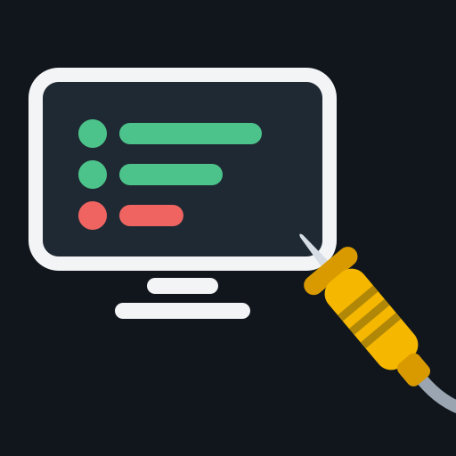

# Fire TV WebView Probe

**Install it on a Fire TV, follow the prompts for three minutes, and see what that device actually delivers to a web page inside a WebView app:** which remote keys reach the page, how Alexa's playback commands arrive, and which ordinary video styles leave a playing video invisible. The report leaves the TV as a QR code.

Built for web developers bringing an existing web app to Fire TV, where the emulator and the real device often disagree and the failures are silent.

## Why

Two things we hit while building a WebView app for Fire TV, neither of which produced a single error:

- **The emulator said yes; the stick said no.** On a Fire TV Stick 4K Plus, every video in our app played (`paused=false`, the clock advancing, the decoder rendering frames) but showed a black or white frame. The cause was two everyday styles: rounded corners on the `<video>`, and a page fade-in whose animation stayed applied. The Android TV emulator showed the videos fine.
- **Voice worked, so nothing told us it was wired wrong.** Amazon's [Media Session guide](https://developer.amazon.com/docs/fire-tv/mediasession-api-integration.html) says an app needs `com.amazon.permission.media.session.voicecommandcontrol` (before Fire OS 14) for Alexa's commands to reach its media session. Without it, Alexa still controlled our app, through plain key events, with "pause" and "play" arriving as the same toggle key. Nothing failed, so nothing pointed us at the missing line.

The probe turns both into something you can see on your own device in minutes, instead of something you find out after shipping.

## What it checks

| Step | What you do | What it records |
|---|---|---|
| Direction pad | Press ↑ ↓ ← → OK | For each key: did it reach the page as a DOM `keydown`, the activity as a key event, or both |
| Media buttons | Press ⏯ ⏪ ⏩ | Same, for media keys |
| Menu | Press ☰ | Same (on the emulator it reaches the activity but never the page) |
| Voice ×5 | Say "Alexa, pause" (while playing, and again while already paused), "play", "rewind", "fast forward" | Every door the command came through, in order: media-session callback (with seek offset), media-button intent, key event (and whether it came from a virtual device), DOM `keydown`, and whether the voice overlay paused the app |
| Video ×4 | Look at the screen, answer → yes / ← no | The same synthetic clip plain, with rounded corners, under a page fade-in that stays applied, and under one that ends. Your answer is stored next to what the `<video>` element itself reported, because the element says "playing" either way |

Before the steps, the start screen shows the device, system and WebView versions, the CSS viewport against the physical display (a 1080p Fire TV can give a page only about 960 CSS px), the page's origin, and whether this build declares the voice permission.

**Two builds, one difference.** `npm run tv` installs *WebView Probe* (declares the voice permission) and *WebView Probe (no voice permission)* side by side. Run the voice steps in both to see, on your device, what that one manifest line changes.

Nothing is sent anywhere: the app has no `INTERNET` permission and loads only its own bundled pages.

## Run it

You need Android Studio (for the Android SDK and its bundled JDK) and Node.js 18+, on Windows, macOS or Linux.

```bash
# Fire TV: Settings → My Fire TV → About → click the device name 7 times, then
# Developer Options → ADB debugging ON. Find the IP under About → Network.
adb connect <fire-tv-ip>
npm run tv              # builds both, installs both, opens the one with the voice permission
npm run tv -- novoice   # opens the one without it
```

With nothing connected, `npm run tv` boots your first Android TV emulator instead.

```bash
npm test   # the checks; no device needed
```

## Reading the report

Each result names the door it came through:

| Code | Door |
|---|---|
| `d` | DOM `keydown` in the page |
| `k` | the activity's key event (`k85v`: key code 85 from a virtual device, `deviceId` −1) |
| `m` | a media-button intent delivered to the media session |
| `s:` | a media-session callback (`s:onPause`; `s:seek-10` = a seek 10 s back from the reported position) |
| `L:` | the activity was paused or resumed |
| `skipped` | you pressed Back before anything arrived. Never read as "nothing arrived" |

`deviceId −1` is reported as *virtual*, not as *voice*: keys injected with `adb shell input keyevent` carry it too.

## Measured devices

Every cell comes from running this probe. An empty row means not measured yet, not "works".

| Device | System · WebView | Viewport | D-pad + OK | ⏯ ⏪ ⏩ | Menu | Voice, with permission | Voice, without | Rounded video | Held fade | Measured |
|---|---|---|---|---|---|---|---|---|---|---|
| Android TV emulator (API 30) | Android 11 · Google WebView 90 | 960×540, DPR 2 | `dk` | `dk` | `k` only | no Alexa on the emulator | no Alexa | visible | visible | 2026-10-01 |
| Fire TV Stick 4K Plus | | | | | | | | | | to be measured |
| Fire TV Stick 4K Select (Vega OS) | | | | | | | | | | to be measured (Vega shell in progress) |

Add your device: run the probe, scan the QR code, and open a pull request with a row built from the report.

## Use the key mapping in your own app

`app/src/main/assets/remote-actions.js` is a small dependency-free module that gives one name to an action whichever door it came through (`up` … `select`, `back`, `menu`, `play`, `pause`, `playPause`, `rewind`, `fastForward`, `next`, `previous`, `seekBack`, `seekForward`, `restart`), keeps the door as `source`, and drops the duplicate when one press arrives through two doors at once. It decides nothing about what an action means in your app.

```js
const remote = RemoteActions.create({ onAction: (a) => console.log(a.action, a.source) });
document.addEventListener('keydown', remote.handleDom);
// Forward what your native shell receives, as ProbeActivity.kt does:
window.addEventListener('probe-native', (e) => remote.handleNative(e.detail));
```

## How it is built

- `app/src/main/java/.../ProbeActivity.kt`: a full-screen WebView that loads bundled pages from `https://appassets.androidplatform.net/assets/` (a real origin, not `file://`). It reports every key event, media-session callback, media-button intent and lifecycle change to the page without interpreting it, lets the keys continue to the WebView, and keeps its media session active the whole time the app is open.
- `app/src/withVoicePermission/AndroidManifest.xml`: the one line the two builds differ by.
- `app/src/main/assets/`: `probe-core.js` (steps, summaries, report), `probe-ui.js` (the prompts), `remote-actions.js` (the mapping above), `test-clip.mp4` (FFmpeg's built-in test pattern, regenerated by `scripts/make-test-clip.sh`).

## Related

- [vega-webview-bridge](https://github.com/aleksandrzly/vega-webview-bridge): fixes for web apps in Vega OS's WebView (a CORS-free request relay, Menu and Back keys). If the probe shows you need those fixes on Vega, use it.
- [firetv-dictation-helper](https://github.com/sanjayshr/firetv-dictation-helper): free-text voice input for Fire TV apps through the system keyboard's dictation. The probe covers transport commands only.

Built during the *Build, Ship, Shape* Amazon Developer Hackathon (2026).

## License

[MIT](LICENSE). Includes [qrcode-generator](https://github.com/kazuhikoarase/qrcode-generator) 1.4.4 by Kazuhiko Arase (MIT), unmodified, in `app/src/main/assets/vendor/`.
